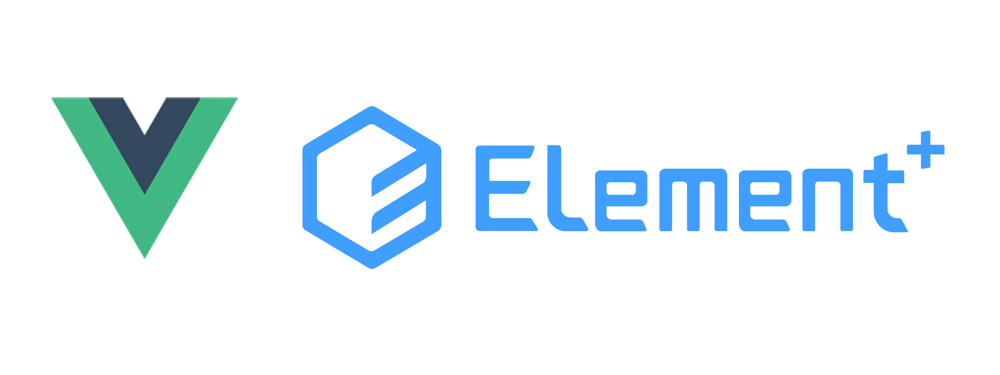
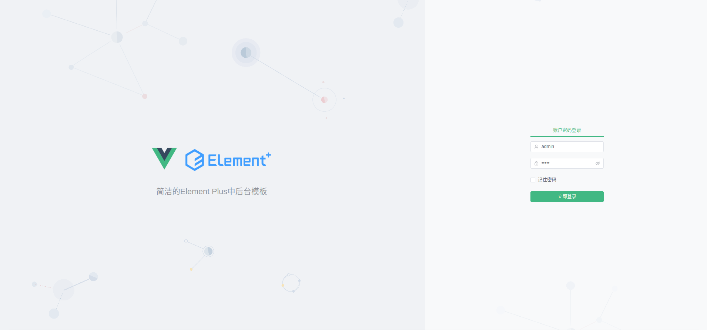
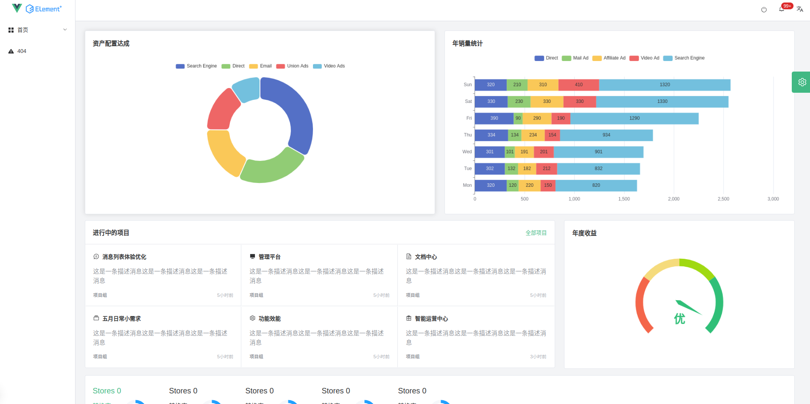
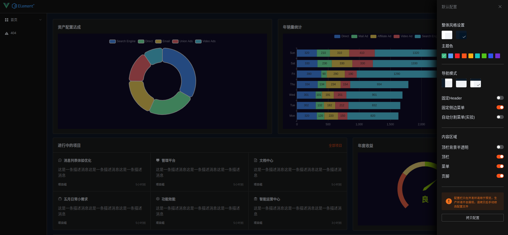

# element-design-pro

> A starter kit for Element Plus with Vite









- Preview: http://feng-lekai.gitee.io/element-design-pro

> 这是基于element-plus-vite-starter进一步开发的模板

​		致力于快速开发后台系统编写的代码。轻量化配置布局、主题、菜单，让开发人员注重内容开发减轻布局上的繁琐配置。

## 默认集成插件

- echarts
- vue-router
- pinia
- unocss
- commitizen
- cz-customizable

## 未来要集成的插件

- vue-i18n
- axios
- mock

## 工具配置

本项目推荐使用 VSCode 进行开发，项目里面已内置 VSCode 配置，包含推荐的插件和设置。（推荐来自Soybean Admin）

以下为推荐的插件：

- [Auto Close Tag](https://marketplace.visualstudio.com/items?itemName=formulahendry.auto-close-tag) - 自动添加 HTML/XML 结束标签
- [Auto Complete Tag](https://marketplace.visualstudio.com/items?itemName=formulahendry.auto-complete-tag) - 为 HTML/XML 添加关闭标签和自动重命名成对的标签
- [Auto Import](https://marketplace.visualstudio.com/items?itemName=steoates.autoimport) - 自动查找、解析和提供所有可用导入的代码操作和代码完成
- [Auto Rename Tag](https://marketplace.visualstudio.com/items?itemName=formulahendry.auto-rename-tag) - 自动重命名成对的 HTML/XML 标签
- [Color Highlight](https://github.com/naumovs/vscode-ext-color-highlight) - 颜色高亮插件
- [DotENV](https://marketplace.visualstudio.com/items?itemName=mikestead.dotenv) - 高亮.env 文件
- [EditorConfig for VS Code](https://marketplace.visualstudio.com/items?itemName=EditorConfig.EditorConfig) - 统一不同编辑器的一些配置
- [ESLint](https://marketplace.visualstudio.com/items?itemName=dbaeumer.vscode-eslint) - 代码检查
- [Git Graph](https://marketplace.visualstudio.com/items?itemName=mhutchie.git-graph) - Git 图形化操作工具
- [GitLens — Git supercharged](https://marketplace.visualstudio.com/items?itemName=eamodio.gitlens) - 显示具体某行代码的 git 信息
- [Icônes](https://marketplace.visualstudio.com/items?itemName=afzalsayed96.icones) - 搜索 iconify 图标的插件
- [Iconify IntelliSense](https://marketplace.visualstudio.com/items?itemName=antfu.iconify) - Iconify 图标实时显示的插件
- [javascript console utils](https://marketplace.visualstudio.com/items?itemName=whtouche.vscode-js-console-utils) - 提供快捷键 ctrl+l 直接输入 console.log()
- [Material Icon Theme](https://marketplace.visualstudio.com/items?itemName=PKief.material-icon-theme) - 图标主题，显示文件和文件多种图标
- [Path Intellisense](https://marketplace.visualstudio.com/items?itemName=christian-kohler.path-intellisense) - 智能显示导入的路径
- [Prettier - Code formatter](https://marketplace.visualstudio.com/items?itemName=esbenp.prettier-vscode) - 代码格式化插件
- [UnoCSS](https://marketplace.visualstudio.com/items?itemName=antfu.unocss) - unocss 写法提示插件
- [Vue Language Features (Volar)](https://marketplace.visualstudio.com/items?itemName=Vue.volar) - volar 插件， Language support for Vue 3
- [Vue VSCode Snippets](https://marketplace.visualstudio.com/items?itemName=sdras.vue-vscode-snippets) - vue2、vue3 写法提示

## 启动项目

```bash
npm install
```

### 运行开发环境

```bash
npm run dev
```

### Compiles and minifies for production

```bash
npm run build
```

### 自定义主题

See `src/styles/element/index.scss`.

## 已知问题修复

1. `ElMenu`在`collapse`生效的时候，如果不固定展开宽度，一级目录出现塌陷

   ```css
   .ep-menu-vertical-demo:not(.ep-menu--collapse) {
     width: 200px;
   }
   ```

   

2. `ElTooltip`在变更`namespace`为`ep`后，`transition`属性也就是`hover`的动画效果不发生变化，需要手动更改

   ```html
   <ElTooltip
       content="清新绿"
       placement="top"
       transition="ep-fade-in-linear"
   >
   	清新绿
   </ElTooltip>
   ```

   

3. `vite`在使用`JSX`后`ElDropdown`部分样式不生效，需要在`vite.config.js`中添加配置

   ```js
   import ElementPlus from "unplugin-element-plus/vite";
   
   plugins: [
   	ElementPlus({
       	useSource: true,
       }),
   ]
   ```

   

4. ...

## `Git` 贡献提交规范

- 参考 [vue](https://gitee.com/link?target=https%3A%2F%2Fgithub.com%2Fvuejs%2Fvue%2Fblob%2Fdev%2F.github%2FCOMMIT_CONVENTION.md) 规范 ([Angular](https://gitee.com/link?target=https%3A%2F%2Fgithub.com%2Fconventional-changelog%2Fconventional-changelog%2Ftree%2Fmaster%2Fpackages%2Fconventional-changelog-angular))
  - `feat` 增加新功能
  - `fix` 修复问题/BUG
  - `style` 代码风格相关无影响运行结果的
  - `perf` 优化/性能提升
  - `refactor` 重构
  - `revert` 撤销修改
  - `test` 测试相关
  - `docs` 文档/注释
  - `chore` 依赖更新/脚手架配置修改等
  - `workflow` 工作流改进
  - `ci` 持续集成
  - `types` 类型定义文件更改
  - `wip` 开发中
